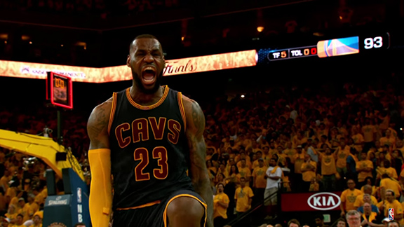
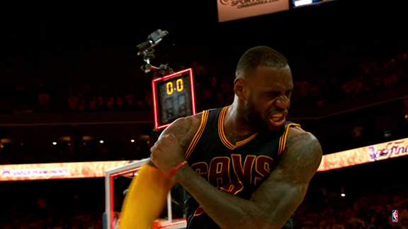
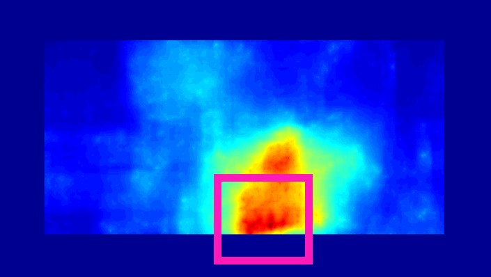

# Template Matching with Deformable Diversity Similarity
<br>
[Itamar Talmi],
[Roey Mechrez](http://cgm.technion.ac.il/people/Roey/),
[Lihi Zelnik-Manor](http://lihi.eew.technion.ac.il/)
<br>


DDIS - MATLAB Mex Version 1.0 (2017-02-21)
Copyright 2006-2017 Itamar Talmi and Roey Mechrez Licensed for noncommercial research use only.

<div align='center'>
  
  
  
  
</div>

  
--------------------------------------------------------------------------------------------------
## Background
--------------------------------------------------------------------------------------------------
This code implements a fast Template Matching in the wild algorithm as part of research at the Technion.

The algorithm solves the following problem: for each image I and a template T we calculate likelihood map of the template location in the image. We calculate the map using a raster scan over the image. DDIS (Deformable Diversity Similarity) done as the similarity measure between each sub window and the template.
For more information see:
```
@article{talmi2016template,
  title={Template Matching with Deformable Diversity Similarity},
  author={Talmi, Itamar and Mechrez, Roey and Zelnik-Manor, Lihi},
  journal={arXiv preprint arXiv:1612.02190},
  year={2016}
}
```

https://arxiv.org/abs/1612.02190
Please cite these paper if you use this code in an academic publication.

--------------------------------------------------------------------------------------------------
## Installation
--------------------------------------------------------------------------------------------------
Dependencies:
 - MatConvNet: see http://www.vlfeat.org/matconvnet/install/
 - imagenet-vgg-verydeep-19.mat should be download from http://www.vlfeat.org/matconvnet/models/imagenet-vgg-verydeep-19.mat and placed inside folder $\DDIS_code_matlab\utils\deepFeatures.
 - TreeCANN: kd tree Coherence Approximate Nearest Neighbor algorithm
            see https://github.com/uva-graphics/patchtable/tree/master/patchtable/TreeCANN
 - FLANN: we find it hard to recomplie the project, we provide mex files. This is optional
            if L2 between deep features is desirable. Otherwise just use cosine distance.

DDIS mex/C++ code:
We provide rebuild mex functions in the bin folder, 
tested using MATLAB 2016a and VS12 (2013)
If you need to rebuild and compile see Installation.txt inside the code folder

--------------------------------------------------------------------------------------------------
## Use
--------------------------------------------------------------------------------------------------
To run one pair of images use DEMOrun.m
to run on the entire dataset use DEMOrunALLData.m
core functions:
 - computeDDIS.m - using RGB patches
 - computeDDIS_deep.m - using deep features patches

--------------------------------------------------------------------------------------------------
## License
--------------------------------------------------------------------------------------------------
   This software is provided under the provisions of the Lesser GNU Public License (LGPL). 
   see: http://www.gnu.org/copyleft/lesser.html.

   This software can be used only for research purposes, you should cite
   the aforementioned papers in any resulting publication.

   The Software is provided "as is", without warranty of any kind.

--------------------------------------------------------------------------------------------------
## Code References
--------------------------------------------------------------------------------------------------
Dekel, Tali, Shaul Oron, Michael Rubinstein, Shai Avidan, and William T. Freeman. "Best-buddies similarity for robust template matching." In Proceedings of the IEEE Conference on Computer Vision and Pattern Recognition, pp. 2021-2029. 2015. Url: http://people.csail.mit.edu/talidekel/Best-Buddies%20Similarity.html

Olonetsky, Igor, and Shai Avidan. "Treecann-kd tree coherence approximate nearest neighbor algorithm." In European Conference on Computer Vision, pp. 602-615. Springer Berlin Heidelberg, 2012. url: https://github.com/uva-graphics/patchtable/tree/master/patchtable/TreeCANN

Muja, Marius, and David G. Lowe. "Fast approximate nearest neighbors with automatic algorithm configuration." VISAPP (1) 2, no. 331-340 (2009): 2. url: http://www.cs.ubc.ca/research/flann/

MatConvNet: CNNs for MATLAB. url: http://www.vlfeat.org/matconvnet/

--------------------------------------------------------------------------------------------------
Version History
--------------------------------------------------------------------------------------------------
* Wish list (to be added soon): 
   Scale and aspect ratio

* Version 1.0 (2017-02-21)
   Initial Release
